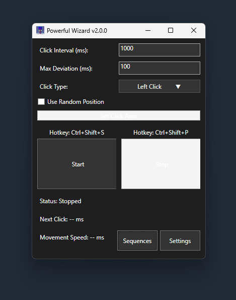

# Powerful Wizard Auto Clicker v2.0.0

A powerful and feature-rich auto clicker with advanced sequence support, visual overlays, and smooth mouse trails for Windows.

## Screenshots

### Main Interface

### Sequence Configurator

## 🚀 Key Features

### 🖱️ **Advanced Auto Clicking**
- **Multiple Click Types**: Left click, right click, middle click, and double click
- **Smart Timing**: Customizable interval and deviation for natural clicking patterns
- **Precision Targeting**: Click at current position or within defined areas
- **Smooth Movement**: Human-like Bézier curve mouse movement between clicks
- **Global Hotkeys**: Start/stop with customizable keyboard shortcuts

### 🎯 **Sequence Automation**
- **Multi-Step Sequences**: Create complex automation workflows with unlimited steps
- **Per-Action Configuration**: Each step has independent click type, delay, deviation, and position
- **Flexible Loop Control**: Run once, loop forever, or repeat a specific number of times
- **Visual Step Editor**: Intuitive card-based interface with drag-and-drop reordering
- **Live Preview**: Test mode to preview sequences before execution
- **Persistent Storage**: Save/load sequences as XML files for reuse

### 👁️ **Visual Feedback System**
- **Click Area Overlay**: See exactly where clicks will occur with highlighted borders
- **Sequence Step Display**: Real-time visualization of all sequence areas with step labels
- **Active Step Highlighting**: Current executing step is highlighted in yellow
- **Live Countdown Timer**: Shows exact milliseconds until next action
- **Status Indicators**: Comprehensive status updates for all operations

### 🌈 **Mouse Trail Effects**
- **Smooth Connected Trails**: No gaps - continuous lines following mouse movement
- **Rainbow Mode**: Psychedelic color-cycling trails through full spectrum
- **Customizable Settings**: Adjust trail length, fade speed, and color
- **Global Overlay**: Trails visible across entire desktop
- **Click-Through Design**: Trails don't interfere with mouse interactions

### ⚙️ **Advanced Settings**
- **Dark Theme UI**: Modern dark interface throughout the application
- **Hotkey Customization**: Configure start/stop shortcuts
- **Movement Speed Control**: Adjust mouse movement timing
- **Position Memory**: Sequences remember configuration between sessions
- **Safe Defaults**: Reasonable limits to prevent system issues

## 🔧 Technical Requirements
- **OS**: Windows 10/11 (64-bit recommended)
- **Framework**: .NET 6.0 Runtime
- **Memory**: ~50MB RAM usage
- **Permissions**: Standard user account (no admin required)

## ⚠️ Important Notes
- **Minimum Interval**: 100ms enforced to prevent system overload
- **Safe Shutdown**: Always use Stop button or hotkey before closing
- **Sequence Validation**: Invalid configurations are caught before execution
- **Click-Through Design**: Overlays won't interfere with target applications
- **Responsible Use**: Intended for automation, testing, and accessibility purposes

## 🆕 Version 2.0.0 Highlights
- ✨ Complete sequence automation system
- 🎨 Global mouse trails with rainbow effects  
- 👁️ Visual overlay system with step tracking
- 🕰️ Real-time countdown timers
- 🎯 Click-through overlays for unobstructed use
- 📱 Modern card-based UI design
- 💾 Persistent sequence memory
- 🖱️ Smooth Bézier curve mouse movement

## 📄 License
This project is provided as-is for educational, automation, and personal use. Please use responsibly and in accordance with the terms of service of any applications you interact with.