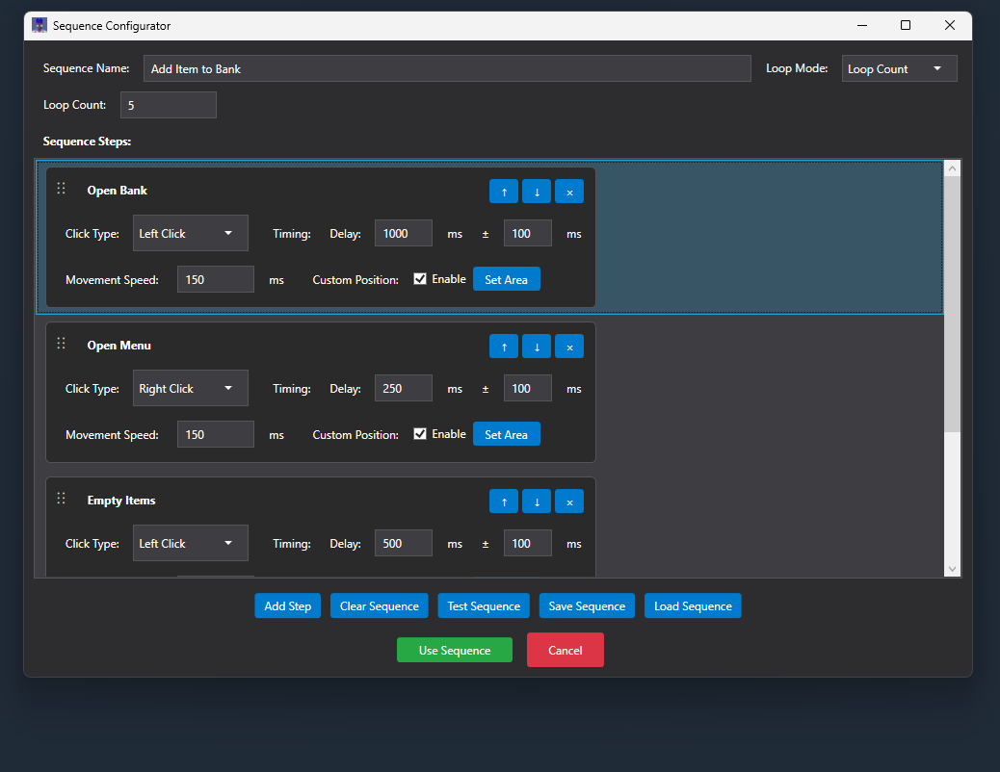

# Powerful Wizard Auto Clicker v2.7.2

A powerful and feature-rich auto clicker with advanced sequence support, visual overlays, smooth mouse trails, and mouse recording capabilities for Windows.

## 🌐 Website
Visit [powerfulwizard.org](https://powerfulwizard.org) for more information and updates.

## 💬 Community
Join our Discord server for support, updates, and community discussion: [Join Discord](https://discord.gg/29jXDr7GHM)

## Screenshots

### Main Interface

### Sequence Configurator

## 🚀 Key Features

### 🖱️ **Advanced Auto Clicking**
- **Multiple Click Types**: Left click, right click, middle click, and double click
- **Smart Timing**: Customizable interval and deviation for natural clicking patterns
- **Precision Targeting**: Click at current position or within defined areas
- **Smooth Movement**: Human-like Bézier curve mouse movement between clicks
- **Global Hotkeys**: Start/stop with customizable keyboard shortcuts

### 🎯 **Sequence Automation**
- **Multi-Step Sequences**: Create complex automation workflows with unlimited steps
- **Per-Action Configuration**: Each step has independent click type, delay, deviation, and position
- **Flexible Loop Control**: Run once, loop forever, or repeat a specific number of times
- **Visual Step Editor**: Intuitive card-based interface with drag-and-drop reordering
- **Live Preview**: Test mode to preview sequences before execution
- **Persistent Storage**: Save/load sequences as XML files for reuse

### 👁️ **Visual Feedback System**
- **Click Area Overlay**: See exactly where clicks will occur with highlighted borders
- **Sequence Step Display**: Real-time visualization of all sequence areas with step labels
- **Active Step Highlighting**: Current executing step is highlighted in yellow
- **Live Countdown Timer**: Shows exact milliseconds until next action
- **Status Indicators**: Comprehensive status updates for all operations

### 🌈 **Mouse Trail Effects**
- **Smooth Connected Trails**: No gaps - continuous lines following mouse movement
- **Rainbow Mode**: Psychedelic color-cycling trails through full spectrum
- **Customizable Settings**: Adjust trail length, fade speed, and color
- **Global Overlay**: Trails visible across entire desktop
- **Click-Through Design**: Trails don't interfere with mouse interactions

### 🎬 **Mouse Recording & Playback**
- **Record Mouse Actions**: Capture mouse movements, clicks, and positions for automation
- **Playback Automation**: Replay recorded sequences with customizable speed
- **Global Hotkeys**: Start/stop recording and playback with F8/F9 keys
- **Recording Validation**: Built-in checks ensure recorded sequences are valid and safe
- **Export/Import**: Save and share recorded sequences between systems

### ⚙️ **Advanced Settings**
- **Dark Theme UI**: Modern dark interface throughout the application
- **Hotkey Customization**: Configure start/stop shortcuts
- **Movement Speed Control**: Adjust mouse movement timing
- **Position Memory**: Sequences remember configuration between sessions
- **Safe Defaults**: Reasonable limits to prevent system issues

### 🎯 **Color Detection & Validation (v2.6.0)**
- **Advanced Color Detection**: OpenCV-powered color matching for precise target identification
- **Click Validation System**: Automatically detects red/yellow click indicators and retries failed clicks immediately
- **Smart Retry Logic**: Failed clicks are retried without waiting for step delays
- **Visual Area Selection**: See exactly where each sequence step will click with highlighted areas
- **OSRS Gaming Support**: Perfect for games with click success/failure indicators

### 🖱️ **Human-like Mouse Movement (v2.6.0)**
- **Natural Movement Patterns**: Variable speed based on distance - longer paths start faster and slow down
- **Mouse Stutter Simulation**: Small 1-3 pixel bumps at click time to simulate human actuation
- **Overshoot Feature**: For long paths (300px+), mouse moves slightly beyond target before snapping back
- **Easing Functions**: Smooth cubic ease-out transitions for natural acceleration/deceleration
- **Distance-Based Speed**: Short movements are 50% faster, long movements are 20% slower

## 🔧 Technical Requirements
- **OS**: Windows 10/11 (64-bit recommended)
- **Framework**: .NET 8.0 Runtime
- **Memory**: ~50MB RAM usage
- **Permissions**: Standard user account (no admin required)

## 📦 Dependencies & Libraries
- **OpenCvSharp4**: Advanced computer vision for color detection and image processing
- **System.Drawing.Common**: Screen capture and bitmap manipulation
- **Windows Forms**: UI framework for overlays and visual elements
- **WPF**: Modern Windows Presentation Foundation for main application interface

## ⚠️ Important Notes
- **Minimum Interval**: 100ms enforced to prevent system overload
- **Safe Shutdown**: Always use Stop button or hotkey before closing
- **Sequence Validation**: Invalid configurations are caught before execution
- **Click-Through Design**: Overlays won't interfere with target applications
- **Responsible Use**: Intended for automation, testing, and accessibility purposes

## 🆕 Version 2.7.2 Highlights
- 🖱️ **Multi-monitor & DPI fix**: Cursor now moves and clicks correctly inside the drawn click area on multi-monitor and scaled displays (trail and cursor no longer offset)
- 📐 **Coordinate conversion**: Click area and color targets (WPF coordinates) are converted to physical screen coordinates before moving the cursor, so clicks land where you set them
- 🌐 **Trail on all monitors**: Mouse trail overlay covers the full virtual screen so the trail appears in the right place on every monitor
- 🎯 **Recording playback on multi-monitor**: Playback uses physical coordinates so recorded movements replay correctly on any setup
- 📌 **Version in window title**: Main window title shows the app version (e.g. "Powerful Wizard v2.7.2")

## Version 2.7.1 Highlights
- 🖱️ **Mouse Position target mode**: Click at the current cursor position — no movement, no jitter; ideal for click-at-cursor workflows (Auto Clicker and sequences)
- ⌨️ **Better Hotkeys**: Use any mouse button (left, right, middle, side buttons) or keyboard key as start/stop hotkeys
- 🎯 **Click-to-Set**: Click in the hotkey box, then press the key or mouse button you want — no typing required
- ✨ **Simpler Target Mode UI**: Single “Set Area” button (shown only when needed), dark theme for target mode controls, default mode is Mouse position
- 👁️ **Click area overlay only when needed**: Overlay appears only when using Click Area target mode; no overlay on startup
- 👁️ **Sequence Editor Overlay**: Fullscreen overlay shows where each step will click while editing sequences
- 🧹 **Simpler options**: “Use Random position” removed; use Mouse position for click-at-cursor or Click Area for random-in-area

## Version 2.6.0 Highlights
- 🎯 **Click Validation System**: Automatically detects failed clicks and retries immediately
- 🌈 **Advanced Color Detection**: OpenCV-powered color matching for precise target identification
- 🖱️ **Human-like Mouse Movement**: Natural movement patterns with overshoot and stutter simulation
- ⚡ **Variable Speed Movement**: Distance-based speed adjustment for realistic automation
- 👁️ **Visual Area Selection**: Enhanced click area visualization for sequence steps
- 🎮 **OSRS Gaming Support**: Perfect for games with click success/failure indicators
- 🚀 **Performance Improvements**: Optimized color detection and movement algorithms
- 💾 **Enhanced Sequence Management**: Better validation and error handling

## 📋 Previous Version Highlights

### Version 2.5.3
- ✨ Enhanced mouse recording and playback system
- 🎨 Improved mouse trails with better performance
- 👁️ Enhanced visual overlay system with better step tracking
- 🕰️ Optimized countdown timers and timing accuracy
- 🎯 Improved click-through overlays for better usability
- 📱 Enhanced UI responsiveness and modern design
- 💾 Better sequence memory and validation
- 🖱️ Smoother mouse movement and positioning

## 🎯 Use Cases & Applications

### 🎮 **Gaming Automation**
- **OSRS High Alchemy**: Perfect for Old School RuneScape spell casting with automatic retry
- **Clicker Games**: Idle games like Cookie Clicker with human-like timing
- **Resource Farming**: Automated collection in various MMOs and simulation games
- **Training Routines**: Complex multi-step automation for skill training

### 💼 **Productivity & Testing**
- **Form Automation**: Repetitive data entry and form filling
- **UI Testing**: Automated testing of application interfaces
- **Data Processing**: Bulk operations on spreadsheets and databases
- **Workflow Automation**: Complex multi-step business processes

### 🖱️ **Accessibility & Assistance**
- **Motor Impairment Support**: Alternative input methods for users with disabilities
- **Repetitive Task Relief**: Reduce strain from monotonous clicking tasks
- **Precision Control**: Enhanced accuracy for fine motor control tasks

## 📄 License
This project is provided as-is for educational, automation, and personal use. Please use responsibly and in accordance with the terms of service of any applications you interact with.